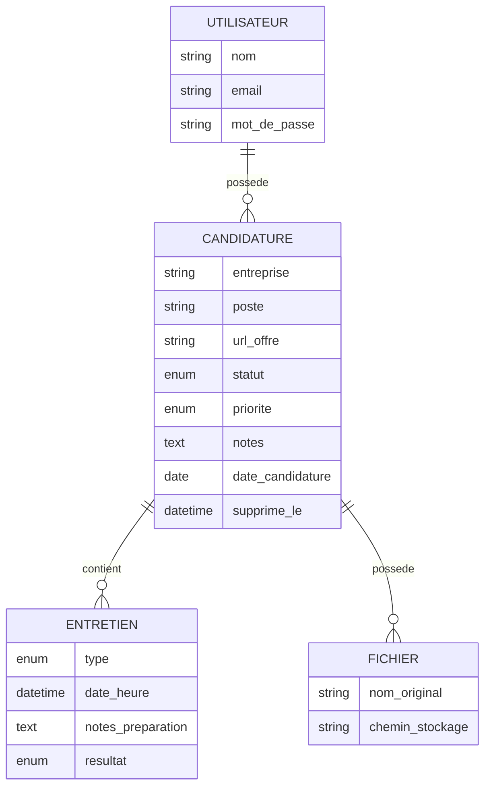
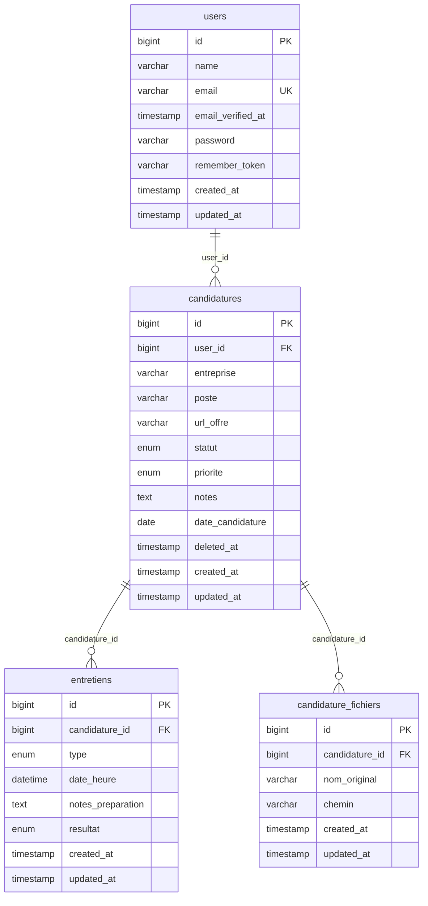

# CandidatureTracker

**CandidatureTracker** est une application web de suivi de candidatures professionnelles. Chaque utilisateur gère ses offres, entretiens, pièces jointes et statistiques depuis un espace personnel sécurisé.

Projet **Laravel 13** (cadre pédagogique) : authentification, CRUD, policies, soft delete, uploads, tests PHPUnit, Docker MySQL.

---

## Sommaire

1. [À quoi sert l'application ?](#à-quoi-sert-lapplication-)
2. [Fonctionnalités](#fonctionnalités)
3. [Stack & prérequis](#stack--prérequis)
4. [Installation rapide](#installation-rapide)
5. [Lancement](#lancement)
6. [Comptes de démo](#comptes-de-démo)
7. [Tests](#tests)
8. [Modèle de données — MCD](#modèle-de-données--mcd)
9. [Modèle de données — MLD](#modèle-de-données--mld)
10. [Architecture](#architecture)
11. [Structure du projet](#structure-du-projet)
12. [Audit qualité (sprint)](#audit-qualité-sprint)
13. [Démo jury (résumé)](#démo-jury-résumé)

---

## À quoi sert l'application ?

Pendant une recherche d'emploi, il est difficile de suivre plusieurs candidatures en parallèle. **CandidatureTracker** centralise :

| Besoin | Solution dans l'app |
|--------|---------------------|
| Où j'ai postulé | Fiche **candidature** (entreprise, poste, date, lien offre, notes) |
| Où j'en suis | **Statut** (en attente, relancé, entretien, offre, refusé, abandonné) et **priorité** |
| Mes rendez-vous | **Entretiens** liés à chaque candidature (type, date, résultat) |
| Mes documents | **Pièces jointes** PDF / DOC / DOCX par candidature |
| Vue globale | **Tableau de bord** (statistiques, prochains entretiens, répartitions) |
| Nettoyage | **Archives** (soft delete + restauration ou suppression définitive) |

**Isolation des données** : un utilisateur ne voit et ne modifie que **ses** candidatures (Laravel Policies → HTTP 403 si accès croisé).

---

## Fonctionnalités

### Authentification
- Inscription, connexion, déconnexion (Laravel Breeze)
- Vérification e-mail (middleware `verified` sur le dashboard)

### Candidatures
- Liste avec **filtres** statut / priorité
- Création, détail, modification
- **Pièces jointes** à la création ou depuis la modification (plusieurs fichiers, max 5 Mo, PDF/DOC/DOCX)
- **Archivage** (soft delete) et page **Archives** (restaurer / supprimer définitivement)

### Entretiens
- Page dédiée **Nouvel entretien** avec liste déroulante des candidatures
- Lien depuis la fiche candidature (candidature pré-sélectionnée)
- Modification et suppression depuis le détail candidature

### Tableau de bord (`/dashboard`)
- Nombre de candidatures actives, entretiens, archives
- Taux candidatures en entretien ou avec offre
- Graphiques par **statut** et **priorité**
- Prochains entretiens et dernières candidatures

### Sécurité & qualité
- `CandidaturePolicy` sur toutes les actions sensibles
- Validation via **Form Requests**
- Tests automatisés (PHPUnit)
- Eager loading pour limiter les requêtes N+1

---

## Stack & prérequis

| Composant | Détail |
|-----------|--------|
| PHP | 8.3+ |
| Laravel | 13 |
| Base | MySQL 8 (Docker) |
| Auth | Laravel Breeze (Blade) |
| Front | Blade, Tailwind CSS, Vite, Alpine.js |
| Tests | PHPUnit |
| Dev | Docker Compose, Laravel Debugbar (optionnel) |

**À installer** : PHP, Composer, Node.js/npm, Docker + Docker Compose, Git.

---

## Installation rapide

```bash
git clone <url-du-repo> candidature-tracker
cd candidature-tracker

composer install
cp .env.example .env
php artisan key:generate
npm install && npm run build

docker compose -f compose.yaml up -d
php artisan migrate:fresh --seed
```

### `.env` (extrait)

```env
APP_URL=http://localhost:8000

DB_CONNECTION=mysql
DB_HOST=127.0.0.1
DB_PORT=3307
DB_DATABASE=candidature_tracker
DB_USERNAME=root
DB_PASSWORD=root
```

| Port | Service |
|------|---------|
| `8000` | Application (`php artisan serve`) |
| `3307` | MySQL (hôte) |
| `8081` | phpMyAdmin |

---

## Lancement

```bash
php artisan serve
```

- Application : **http://localhost:8000** → redirige vers le **tableau de bord**
- phpMyAdmin : **http://localhost:8081** (`root` / `root`, base `candidature_tracker`)

En développement, lancer aussi Vite si vous modifiez le front :

```bash
npm run dev
```

---

## Comptes de démo

Créés par `php artisan db:seed` :

| E-mail | Mot de passe | Rôle |
|--------|--------------|------|
| `alice@example.com` | `password` | Données de démo complètes |
| `bob@example.com` | `password` | Tester le refus d'accès (403) aux données d'Alice |

---

## Tests

Créer la base de test (une fois) :

```bash
mysql -h 127.0.0.1 -P 3307 -u root -proot \
  -e "CREATE DATABASE IF NOT EXISTS candidature_tracker_testing;"
```

```bash
php artisan test
```

Couverture : authentification, policies, CRUD candidatures, archives, uploads, entretiens, dashboard.

---

## Modèle de données — MCD

**MCD** (modèle conceptuel) : entités métier et cardinalités, sans détail technique.



**Légende des relations**

| Relation | Cardinalité | Signification |
|----------|-------------|---------------|
| Utilisateur → Candidature | 1,N | Un utilisateur a plusieurs candidatures |
| Candidature → Entretien | 1,N | Une candidature peut avoir plusieurs entretiens |
| Candidature → Fichier | 1,N | Une candidature peut avoir plusieurs pièces jointes |

**Règles métier**
- Une candidature appartient à **un seul** utilisateur.
- Archivage = marquage logique (`deleted_at`), pas de suppression immédiate en base.
- Suppression d'une candidature entraîne la suppression des entretiens et fichiers associés (cascade).

---

## Modèle de données — MLD

**MLD** (modèle logique) : tables, clés primaires (PK), clés étrangères (FK) et types SQL implémentés en MySQL.



### Détail des tables

#### `users`
| Colonne | Type | Contrainte |
|---------|------|------------|
| `id` | BIGINT | PK, auto-increment |
| `name` | VARCHAR | NOT NULL |
| `email` | VARCHAR | UNIQUE, NOT NULL |
| `email_verified_at` | TIMESTAMP | NULLABLE |
| `password` | VARCHAR | NOT NULL |
| `remember_token` | VARCHAR | NULLABLE |
| `created_at`, `updated_at` | TIMESTAMP | |

#### `candidatures`
| Colonne | Type | Contrainte |
|---------|------|------------|
| `id` | BIGINT | PK |
| `user_id` | BIGINT | FK → `users.id`, ON DELETE CASCADE |
| `entreprise`, `poste` | VARCHAR | NOT NULL |
| `url_offre` | VARCHAR | NULLABLE |
| `statut` | ENUM | `en_attente`, `relance`, `entretien`, `offre`, `refuse`, `abandonne` |
| `priorite` | ENUM | `haute`, `moyenne`, `basse` |
| `notes` | TEXT | NULLABLE |
| `date_candidature` | DATE | NOT NULL |
| `deleted_at` | TIMESTAMP | NULLABLE (SoftDeletes) |
| `created_at`, `updated_at` | TIMESTAMP | |

#### `entretiens`
| Colonne | Type | Contrainte |
|---------|------|------------|
| `id` | BIGINT | PK |
| `candidature_id` | BIGINT | FK → `candidatures.id`, ON DELETE CASCADE |
| `type` | ENUM | `telephone`, `visio`, `presentiel`, `technique`, `rh` |
| `date_heure` | DATETIME | NOT NULL |
| `notes_preparation` | TEXT | NULLABLE |
| `resultat` | ENUM | `en_attente`, `positif`, `negatif` |
| `created_at`, `updated_at` | TIMESTAMP | |

#### `candidature_fichiers`
| Colonne | Type | Contrainte |
|---------|------|------------|
| `id` | BIGINT | PK |
| `candidature_id` | BIGINT | FK → `candidatures.id`, ON DELETE CASCADE |
| `nom_original` | VARCHAR | Nom affiché à l'utilisateur |
| `chemin` | VARCHAR | Chemin sur disque (`storage/app/...`) |
| `created_at`, `updated_at` | TIMESTAMP | |

> Tables Laravel standards (hors métier) : `password_reset_tokens`, `sessions`, `cache`, `jobs`.

---

## Architecture

| Couche | Rôle |
|--------|------|
| **Routes** | `routes/web.php` — middleware `auth`, routes nommées |
| **Controllers** | `DashboardController`, `CandidatureController`, `EntretienController`, `CandidatureFichierController` |
| **Form Requests** | Validation des entrées (candidatures, entretiens) |
| **Policies** | `CandidaturePolicy`, `EntretienPolicy` — propriété via `user_id` |
| **Models** | `User`, `Candidature`, `Entretien`, `CandidatureFichier` |
| **Views** | Blade + composants (`x-app-layout`, badges, formulaires) |
| **Storage** | Fichiers privés `local` — dossier `candidatures/{user_id}/` |

**Routes importantes**

| Méthode | URI | Nom |
|---------|-----|-----|
| GET | `/dashboard` | `dashboard` |
| GET/POST | `/candidatures` | `candidatures.index` / `store` |
| GET | `/candidatures/{id}` | `candidatures.show` |
| GET | `/candidatures/archives` | `candidatures.archives` |
| GET/POST | `/entretiens/create` | `entretiens.create` / `store` |

---

## Structure du projet

```
candidature-tracker/
├── app/
│   ├── Http/Controllers/
│   │   ├── DashboardController.php
│   │   ├── CandidatureController.php
│   │   ├── EntretienController.php
│   │   └── CandidatureFichierController.php
│   ├── Http/Requests/
│   ├── Models/
│   └── Policies/
├── database/migrations/    # Schéma MySQL
├── database/seeders/       # Alice, Bob, candidatures exemples
├── resources/views/
│   ├── dashboard.blade.php
│   ├── candidatures/
│   └── entretiens/
├── routes/web.php
├── tests/Feature/
├── compose.yaml            # MySQL + phpMyAdmin
└── README.md
```

---

## Audit qualité (sprint)

Rapport d'audit code (Form Requests, policies, validation FR, suppression des `abort(404)` métier) :

**[docs/AUDIT-SPRINT.md](docs/AUDIT-SPRINT.md)**

---

## Démo jury (résumé)

1. Connexion `alice@example.com` → **tableau de bord**
2. Créer 2 candidatures (statuts / priorités différents) + pièces jointes
3. **Nouvel entretien** (menu ou fiche candidature)
4. Filtrer la liste par statut
5. Archiver → **Archives** → restaurer
6. Navigateur 2 : `bob@example.com` → tenter d'éditer la candidature d'Alice → **403**
7. `php artisan test` → suite verte

---

## Licence

MIT — voir le dépôt pour le détail.
