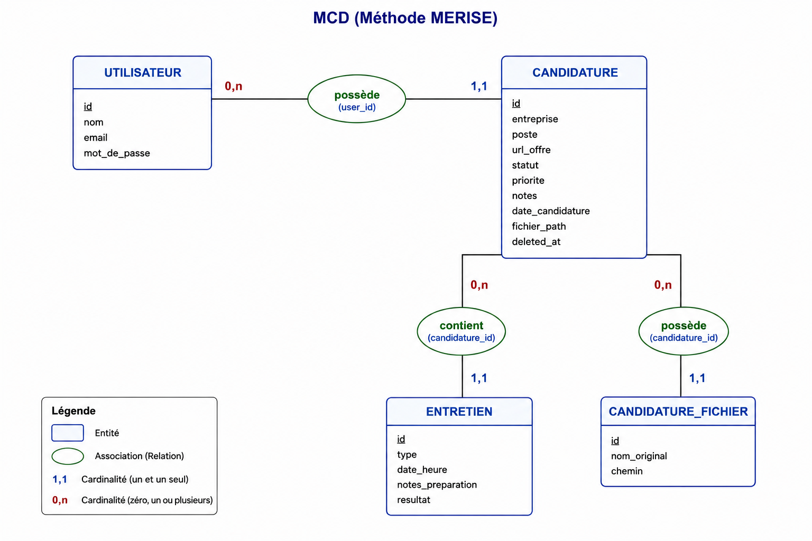
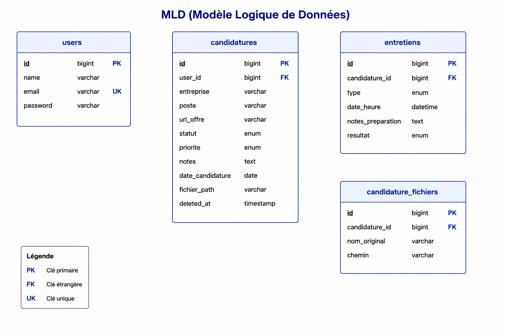

# CandidatureTracker

**CandidatureTracker** est une application web de suivi de candidatures professionnelles. Chaque utilisateur gère ses offres, entretiens, pièces jointes et statistiques depuis un espace personnel sécurisé.

Projet **Laravel 13** : authentification Breeze, CRUD, policies, soft delete, uploads, tests PHPUnit, MySQL via Docker.

---

## 🧭 Project Overview

Pendant une recherche d'emploi, il est difficile de suivre plusieurs candidatures en parallèle. L'application centralise :

| Besoin | Solution |
|--------|----------|
| Où j'ai postulé | Fiche **candidature** (entreprise, poste, date, lien offre, notes) |
| Où j'en suis | **Statut** et **priorité** |
| Mes rendez-vous | **Entretiens** (type, date, résultat, notes de préparation) |
| Mes documents | **Pièces jointes** PDF / DOC / DOCX |
| Vue globale | **Tableau de bord** (KPI, agenda entretiens, graphiques) |
| Nettoyage | **Archives** (soft delete, restauration, suppression définitive) |

**Isolation des données** : un utilisateur ne voit et ne modifie que **ses** candidatures (`CandidaturePolicy` → HTTP 403 si accès croisé).

### Fonctionnalités principales

- **Auth** — Inscription, connexion, profil, vérification e-mail (`verified` sur le dashboard)
- **Candidatures** — Liste filtrable, CRUD, archivage, pièces jointes multiples (5 Mo max)
- **Entretiens** — Création (date future obligatoire), édition (date libre), types enum, résultat dont **Annulé**
- **Dashboard** — Prochain entretien, alertes préparation, résultats à renseigner, répartitions statut/priorité

---

## 🛠 Tech Stack

| Couche | Technologie |
|--------|-------------|
| Backend | PHP 8.3, Laravel 13 |
| Auth | Laravel Breeze (Blade) |
| Base de données | MySQL 8.0 (Docker) |
| ORM | Eloquent |
| Front | Blade, Tailwind CSS, Vite, Alpine.js |
| Tests | PHPUnit |
| Dev | Docker Compose (MySQL + phpMyAdmin), Laravel Debugbar (optionnel) |
| Fichiers | `Storage` disque `local` |

**Prérequis locaux** : PHP, Composer, Node.js/npm, Docker + Docker Compose, Git.

---

## 🏗 Architecture

```
Requête HTTP
    → middleware (auth, verified)
    → Controller
    → $this->authorize() / Policy
    → Form Request (validation)
    → Model Eloquent
    → Blade View
```

| Couche | Emplacement | Rôle |
|--------|-------------|------|
| Routes | `routes/web.php`, `routes/auth.php` | URIs nommées, middleware `auth` |
| Controllers | `app/Http/Controllers/` | Logique HTTP, eager loading |
| Form Requests | `app/Http/Requests/` | Règles de validation (pas de `$request->validate()` dans les controllers) |
| Policies | `app/Policies/` | Propriété des ressources (`user_id`) |
| Models | `app/Models/` | `Candidature`, `Entretien`, `CandidatureFichier`, `User` |
| Views | `resources/views/` | Blade, composants, layout sidebar |
| Storage | `storage/app/` | Fichiers privés `candidatures/{user_id}/` |

**Controllers métier** : `DashboardController`, `CandidatureController`, `EntretienController`, `CandidatureFichierController`.

---

## 🚀 Getting Started

```bash
git clone <url-du-repo> candidature-tracker
cd candidature-tracker

composer install
cp .env.example .env
php artisan key:generate
npm install && npm run build

docker compose up -d
php artisan migrate:fresh --seed
```

Lancer l'application :

```bash
php artisan serve
```

- Application : **http://localhost:8000** (redirige vers `/dashboard`)
- phpMyAdmin : **http://localhost:8081**

Front en développement (hot reload) :

```bash
npm run dev
```

### Comptes de démo

Créés par `php artisan db:seed` :

| E-mail | Mot de passe | Usage |
|--------|--------------|-------|
| `alice@example.com` | `password` | Données de démo complètes |
| `bob@example.com` | `password` | Tester le refus d'accès (403) aux données d'Alice |

---

## ⚙️ Environment Configuration

Copier `.env.example` vers `.env`, puis ajuster :

```env
APP_NAME=CandidatureTracker
APP_URL=http://localhost:8000
APP_LOCALE=fr

DB_CONNECTION=mysql
DB_HOST=127.0.0.1
DB_PORT=3307
DB_DATABASE=candidature_tracker
DB_USERNAME=root
DB_PASSWORD=root

FILESYSTEM_DISK=local
DEBUGBAR_ENABLED=true
```

| Variable | Description |
|----------|-------------|
| `APP_URL` | URL de l'app (`php artisan serve`) |
| `DB_*` | Connexion MySQL exposée par Docker sur le port **3307** |
| `FILESYSTEM_DISK` | Stockage des pièces jointes (`local`) |
| `DEBUGBAR_ENABLED` | Barre de debug (détection N+1) |

| Port | Service |
|------|---------|
| `8000` | Application Laravel |
| `3307` | MySQL (hôte → conteneur `3306`) |
| `8081` | phpMyAdmin |

---

## 🗄 Database

### Schémas

**MCD** (modèle conceptuel) :



**MLD** (modèle logique) :



> Les pièces jointes sont dans `candidature_fichiers` (relation 1,N avec `candidatures`).

### Commandes

```bash
docker compose -f compose.yaml up -d
php artisan migrate
php artisan db:seed
# ou réinitialisation complète :
php artisan migrate:fresh --seed
```

### Tables métier (résumé)

| Table | Description |
|-------|-------------|
| `users` | Comptes (Breeze) |
| `candidatures` | Candidatures (`deleted_at` = soft delete) |
| `entretiens` | Entretiens liés à une candidature |
| `candidature_fichiers` | Pièces jointes (nom, chemin) |

#### `candidatures`

| Colonne | Type | Notes |
|---------|------|-------|
| `statut` | ENUM | `en_attente`, `relance`, `entretien`, `offre`, `refuse`, `abandonne` |
| `priorite` | ENUM | `haute`, `moyenne`, `basse` |
| `deleted_at` | TIMESTAMP | Archivage (SoftDeletes) |

#### `entretiens`

| Colonne | Type | Notes |
|---------|------|-------|
| `type` | ENUM | `telephone`, `visio`, `presentiel`, `technique`, `rh` |
| `resultat` | ENUM | `en_attente`, `positif`, `negatif`, `annule` |
| `date_heure` | DATETIME | Création : futur uniquement ; édition : toute date valide |

Diagrammes détaillés : [docs/MCD-MLD.md](docs/MCD-MLD.md) (si présent localement).

---

## 🗺 Routes Reference

Toutes les routes métier sont protégées par `middleware('auth')`. Le dashboard exige aussi `verified`.

### Application

| Méthode | URI | Nom | Description |
|---------|-----|-----|-------------|
| GET | `/` | — | Redirection → `/dashboard` |
| GET | `/dashboard` | `dashboard` | Tableau de bord |

### Candidatures

| Méthode | URI | Nom | Description |
|---------|-----|-----|-------------|
| GET | `/candidatures` | `candidatures.index` | Liste (+ filtres statut / priorité) |
| GET | `/candidatures/create` | `candidatures.create` | Formulaire création |
| POST | `/candidatures` | `candidatures.store` | Enregistrer |
| GET | `/candidatures/archives` | `candidatures.archives` | Candidatures archivées |
| GET | `/candidatures/{candidature}` | `candidatures.show` | Détail + entretiens |
| GET | `/candidatures/{candidature}/edit` | `candidatures.edit` | Modifier |
| PUT | `/candidatures/{candidature}` | `candidatures.update` | Mettre à jour |
| DELETE | `/candidatures/{candidature}` | `candidatures.destroy` | Archiver (soft delete) |
| PUT | `/candidatures/{id}/restore` | `candidatures.restore` | Restaurer depuis archives |
| DELETE | `/candidatures/{id}/force` | `candidatures.forceDelete` | Suppression définitive |
| GET | `/candidatures/{candidature}/fichiers/{fichier}/download` | `candidatures.fichiers.download` | Télécharger une pièce jointe |
| DELETE | `/candidatures/{candidature}/fichiers/{fichier}` | `candidatures.fichiers.destroy` | Supprimer un fichier |

> `/candidatures/archives` est déclaré **avant** `/candidatures/{candidature}` pour éviter le conflit de routes.

### Entretiens

| Méthode | URI | Nom | Description |
|---------|-----|-----|-------------|
| GET | `/entretiens/create` | `entretiens.create` | Nouvel entretien (`?candidature_id=` optionnel) |
| POST | `/entretiens` | `entretiens.store` | Créer (date ≥ maintenant) |
| GET | `/entretiens/{entretien}/edit` | `entretiens.edit` | Modifier (date libre) |
| PUT | `/entretiens/{entretien}` | `entretiens.update` | Mettre à jour |
| DELETE | `/entretiens/{entretien}` | `entretiens.destroy` | Supprimer |

### Profil & Auth (Breeze)

| Méthode | URI | Nom |
|---------|-----|-----|
| GET | `/profile` | `profile.edit` |
| PATCH | `/profile` | `profile.update` |
| GET/POST | `/login`, `/register`, `/logout` | `login`, `register`, `logout` |
| GET/POST | `/forgot-password`, `/reset-password` | Réinitialisation mot de passe |
| GET | `/verify-email` | Vérification e-mail |

Lister toutes les routes : `php artisan route:list`

---

## 🧪 Running Tests

Créer la base de test (une fois) :

```bash
mysql -h 127.0.0.1 -P 3307 -u root -proot \
  -e "CREATE DATABASE IF NOT EXISTS candidature_tracker_testing;"
```

Exécuter la suite :

```bash
php artisan test
```

| Fichier | Couverture |
|--------|------------|
| `AuthAccessTest` | Redirection invité |
| `PolicyTest` | Accès croisé (403) |
| `CandidatureTest` | CRUD, validation |
| `ArchiveTest` | Archivage / restauration |
| `FileUploadTest` | Upload / download |
| `EntretienTest` | CRUD entretiens, date future à la création |
| `DashboardTest` | Tableau de bord |

---

## 🛡 Security Checklist

| Point | Implémentation |
|-------|----------------|
| Authentification | Middleware `auth` sur toutes les routes métier |
| Vérification e-mail | Middleware `verified` sur `/dashboard` |
| Autorisation | `CandidaturePolicy`, `EntretienPolicy` + `$this->authorize()` |
| Pas d'IDOR | `user_id` toujours depuis `auth()->id()`, jamais depuis le formulaire |
| Validation serveur | Form Requests (`Store*`, `Update*`, `Filter*`) |
| CSRF | `@csrf` sur tous les formulaires |
| Fichiers | Téléchargement via controller + policy (pas d'URL publique directe) |
| Types fichiers | `mimes:pdf,doc,docx`, taille max 5 Mo |
| Soft delete | Pas de fuite des candidatures archivées dans les listes actives |
| Scope bindings | `scopeBindings()` sur le groupe de routes |

---

## 🧠 Key Laravel Concepts

| Concept | Usage dans le projet |
|---------|----------------------|
| **Eloquent** | Relations `User` → `Candidature` → `Entretien` / `CandidatureFichier` |
| **Soft Deletes** | `Candidature::delete()` archive ; `restore()`, `onlyTrashed()` |
| **Policies** | Qui peut voir / modifier / supprimer une candidature |
| **Form Requests** | Validation centralisée (ex. date future à la création d'un entretien) |
| **Route model binding** | `{candidature}`, `{entretien}` avec `scopeBindings()` |
| **Named routes** | `route('candidatures.show', $c)` partout dans les vues |
| **Eager loading** | `with('entretiens')`, `with('candidature')` — vérifier via Debugbar |
| **Blade components** | `x-app-layout`, `x-status-badge`, `x-flash-alert` |
| **Storage** | `store()` sur disque `local`, chemin en base |
| **Factories & Seeders** | Données de démo (Alice / Bob) pour tests et présentation |

---

## Structure du projet

```
candidature-tracker/
├── app/
│   ├── Http/Controllers/
│   │   ├── DashboardController.php
│   │   ├── CandidatureController.php
│   │   ├── EntretienController.php
│   │   └── CandidatureFichierController.php
│   ├── Http/Requests/
│   ├── Models/
│   └── Policies/
├── database/migrations/
├── database/seeders/
├── resources/views/
│   ├── dashboard.blade.php
│   ├── candidatures/
│   ├── entretiens/
│   └── layouts/
├── routes/web.php
├── tests/Feature/
├── docs/                  # MCD.png, MLD.png
├── compose.yaml           # MySQL + phpMyAdmin
└── README.md
```

---

## Licence

MIT — voir le dépôt pour le détail.
